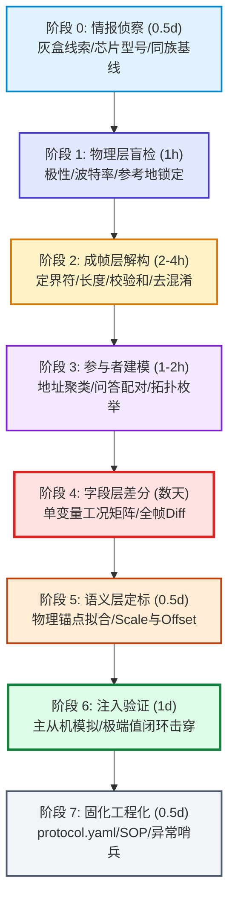

# 串行总线与嵌入式协议逆向工程通用实战指南 (Serial Bus Protocol Reverse Engineering Playbook)

[](https://github.com/bomb632/protocol-reverse-engineering-guide/stargazers)
[](LICENSE)
[-blue?style=flat-square&logo=microsoftword)](协议逆向通用流程.docx)
[](protocol.yaml)
[-orange?style=flat-square)](#)

> **提炼源起**：本项目沉淀自 **某品牌智能二轮车一线通/485通信协议（全程逆向实战）**。  
> **核心目标**：解耦协议特性与逆向方法论。面对任何一种未知工业总线/单线/串行协议（BMS、电控、仪表、传感器），均可遵循此流水线标准，在 **数天内低成本走到「可解析、可模拟、可注入、可替换」的完整工程闭环**。

---

## 📑 目录 (Table of Contents)

- [一、核心思想与三条铁律](#一核心思想与三条铁律)
- [二、全生命周期流水线总览](#二全生命周期流水线总览)
- [三、八大阶段深度拆解与实战落地](#三八大阶段深度拆解与实战落地)
  - [阶段 0：情报侦察与灰盒基线 (0.5天)](#阶段-0情报侦察与灰盒基线-05天)
  - [阶段 1：物理层盲检与信号调理 (1小时)](#阶段-1物理层盲检与信号调理-1小时)
  - [阶段 2：成帧层语法与校验解构 (2-4小时)](#阶段-2成帧层语法与校验解构-2-4小时)
  - [阶段 3：网络拓扑与参与者建模 (1-2小时)](#阶段-3网络拓扑与参与者建模-1-2小时)
  - [阶段 4：字段层单变量差异化攻坚 (核心·数天)](#阶段-4字段层单变量差异化攻坚-核心数天)
  - [阶段 5：物理语义与定标拟合 (0.5天)](#阶段-5物理语义与定标拟合-05天)
  - [阶段 6：全双工注入验证与行为闭环 (1天)](#阶段-6全双工注入验证与行为闭环-1天)
  - [阶段 7：知识固化与工程化交付 (0.5天)](#阶段-7知识固化与工程化交付-05天)
- [四、协议无关架构：通用内核 vs 协议配置](#四协议无关架构通用内核-vs-协议配置)
- [五、标准协议配置模板 (`protocol.yaml`)](#五标准协议配置模板-protocolyaml)
- [六、现场排障 SOP 速查卡](#六现场排障-sop-速查卡)
- [七、总结与生态赋能](#七总结与生态赋能)

---

## 一、核心思想与三条铁律

在嵌入式协议逆向工程中，绝大多数失败并非源于数学难度，而是由于「从纯黑盒猜想」、「多变量交叉污染」以及「纸面解码自嗨」。必须严格贯彻以下三条工程铁律：

### 1. 灰盒优先：动手前先打情报战，拒绝纯黑盒盲猜
> [!IMPORTANT]
> **动手拿烙铁之前，先搜刮所有公开情报。**  
> 寻找官方上位机/APP安装包进行反编译（ILSpy、JADX、Ghidra）、检索同品牌历史专利、检索 GitHub 开源同族项目、拆壳识别收发器与主控芯片。  
> **实战战果**：某二轮车协议项目在接线前，通过 ILSpy 反编译官方诊断上位机软件（.NET程序），直接提取出带原始英文字段名的处理函数骨架，一举跳过 80% 的盲猜路径。

### 2. 单变量对照：一切字段定位与确认的绝对根基
> [!WARNING]
> **每次对照实验只允许变更一个物理量，其余环境变量必须绝对冻结！**  
> 只能变 SOC，就不能动温度；动了充电机插拔，就不能改变负载电流。  
> 多变量同时波动＝差分数据彻底污染＝引入无效变量干扰。单变量实验是穿透混淆与定位偏移的唯一科学路径。

### 3. 注入验证：设备行为闭环是检验真理的唯一金标准
> [!CAUTION]
> **解码「看起来完全合理」≠ 目标设备真的采用这个字段！**  
> 只有完成「人工注入极端伪造值 → 目标设备（如车机仪表屏）即刻产生符合预期的显示变化」才算闭环确认。  
> **惨痛教训**：该二轮车协议充电时间字段（`off54`）曾历经三次重大误判（误认 `off143` 计数器 → 误以为车机内部计时 → 猜想状态转变边沿触发）。最终靠直接注入虚假数值 `20`，使整车仪表立刻跳变显示「充电时间2.0小时」，才彻底锤定字段真相。

---

## 二、全生命周期流水线总览

整个逆向与工程化流程采用标准门禁流水线，上一阶段未达标绝不盲目进入下一阶段：



| 阶段 | 阶段名称 | 预计耗时 | 核心产出 | 准出判据 |
| :--- | :--- | :--- | :--- | :--- |
| **P0** | 情报侦察 | 0.5 天 | 协议参考基线、命令候选、芯片丝印 | 搜集到同族协议或上位机逆向线索 |
| **P1** | 物理层盲检 | 1 小时 | 波特率、数据位、停止位、极性、电平 | 逻辑分析仪停止位正确率 >90% 且能清晰切出字符 |
| **P2** | 成帧层解构 | 2-4 小时 | 帧定界、长度规则、校验算法、混淆公式 | 能够 100% 校验通过线上抓取的所有历史报文 |
| **P3** | 参与者建模 | 1-2 小时 | 设备拓扑表、主从关系、命令码映射表 | 厘清通信主从节点、广播/单播机制与应答超时 |
| **P4** | 字段层差分 | 2-4 天 | 物理变量 offset 矩阵、单变量映射图谱 | 单变量改变仅命中唯一字节区间，无误报干扰 |
| **P5** | 语义层定标 | 0.5 天 | 物理单位、比例系数 (Scale)、零点偏置 (Offset) | 3点以上客观物理锚点拟合 $R^2 > 0.999$ |
| **P6** | 注入验证 | 1 天 | 从机模拟器、主机问询器、真机闭环测试记录 | 伪造数据成功驱动真实目标设备正常显示与工作 |
| **P7** | 固化工程化 | 0.5 天 | `protocol.yaml`、排障 SOP、哨兵监控脚本 | 配置文件可直接驱动通用协议转换网关运行 |

---

## 三、八大阶段深度拆解与实战落地

### 阶段 0：情报侦察与灰盒基线 (0.5天)

#### 🎯 核心目标
将目标协议从「全未知纯黑盒」转化为「已知骨架、实测细节」的「灰盒状态」，寻找真值对照设备（Ground-Truth Reference）。

#### 🛠️ 标准动作
1. **拆机与硬件丝印取证**：对主控 MCU、通信收发芯片（RS485、CAN 收发器、光耦隔离器）拍照识别。
2. **反编译与公开资产搜刮**：
   - 官方售后上位机、PC 诊断软件（C# 使用 ILSpy，C/C++ 使用 IDA Pro / Ghidra）。
   - 官方手机 APP（APK 逆向，JADX 提取 Bluetooth/MQTT/串口协议封装代码）。
   - 中国知网/国家知识产权局专利搜索（通信协议常以发明专利公开）。
   - GitHub、开源社区、Gitee 检索同品牌旧型号逆向库。
3. **锚定真值基线设备**：选取一台已知协议的工业设备作为真实物理量基准（如高精度标定源表/标准电量计采集真实电压/温度）。

#### 💡 二轮车协议实战案例
- **灰盒突破**：官方诊断上位机软件 通过 ILSpy 反编译，瞬间获取通信协议字段框架及全部变量名；GitHub 找到同品牌旧款协议 Python 实现。
- **真值标尺**：将标准已知协议保护板接入同一电池包，为后续未知数据流提供电压（V）、温度（T）、电流（I）的高精度真值对照标尺。

> [!TIP]
> **避坑警示**：同族协议 $
e$ 相同协议！主机厂极常在不同车型、年份演进中调整命令码、字段偏移甚至校验规则。情报仅作为「对拍尺」，绝不可盲目照抄。

---

### 阶段 1：物理层盲检与信号调理 (1小时)

#### 🎯 核心目标
锁定信号物理层电气属性，消除硬件误接带来的逻辑假象，确保采集字节流无误码。

#### 🛠️ 标准动作
1. **地线参考规范**：逻辑分析仪的地线（GND）**必须直连电池负极总端（B-）**，坚决禁止接在保护板功率 MOS 后的充放电负极（C- / P-）。
2. **波特率 × 极性盲检矩阵**：
   - 逻辑分析仪挂线，抓取设备运行、唤醒、开机时 10~30s 原始脉宽。
   - 统计电平跳变时间间隔（Gap Histogram），取**最小显著众数（Dominant Mode）**计算基准位宽：
     $$	ext{Baudrate} pprox 
rac{1}{\min(\Delta t_{	ext{dominant}})}$$
   - 遍历极性（正极性 Idle High / 反极性 Idle Low）与校验位组合（8N1、8E1、8O1、8N2）。

#### 💡 二轮车协议实战案例
- **电气特性**：实测 9600bps，数据位 8，偶校验 (Even)，停止位 1（**9600 8E1**），单线半双工 3.3V TTL/485。
- **极性陷阱**：整车车内总线为正极性，但**原厂充电机侧通信因内置光耦隔离反相，呈现完全反极性**。同一协议家族，不同接口硬件极性相反。

```
正极性 (车内总线) : 空闲高电平 (3.3V) ──┐        ┌──────
                                         └──起始位──┘
反极性 (充电机侧) : 空闲低电平 (0.0V) ──┐        ┌──────
                                         └──起始位──┘ (光耦反相)
```

> [!CAUTION]
> **物理层头号杀手：地参考漂移！**  
> 当地线夹在保护板 C-/P- 时，一旦充放电 MOS 截止，C- 与 B- 之间将产生高达数十伏的压差，导致分析仪参考电平严重偏移，表现为「间歇性通信中断/乱码」。**排查协议问题前，先量 C- 与 B- 之间的万用表压差！**

---

### 阶段 2：成帧层语法与校验解构 (2-4小时)

#### 🎯 核心目标
破译报文结构（Grammar），推导定界机制、校验和公式及数据混淆算法，实现原始报文 100% 正确切片。

#### 🛠️ 标准动作与流水线
1. **帧头定界挖掘**：统计海量原始字节中高频出现的重复字节模式（如 `0x68`、`0xAA 0x55`、`0x7E`、`0x5A`）。
2. **帧长界定推导**：
   - 显式长度：观察帧头附近字节是否与「整帧长度」或「数据载荷长度」严格随数据增减线性递增。
   - 字节间隔（Inter-byte Timeout）：总线静默时间聚类（如 Modbus 3.5 字符时间）。
3. **校验算法阶梯枚举测试**（按算力消耗与复杂度依次验证）：
   $$	ext{None} 	o 	ext{Sum8 (mod 256)} 	o 	ext{Sum8 (补码/Two's Complement)} 	o 	ext{XOR (异或和)} 	o 	ext{CRC-8} 	o 	ext{CRC-16 (Modbus/XMODEM/CCITT)} 	o 	ext{CRC-32}$$
4. **混淆与编码穿透**：观察 Data 区，尝试 $\pm 	ext{Offset}$、$	ext{XOR 掩码}$、高低半字节翻转。
   - 判据：解混淆后，文本区是否出现可读 ASCII（如 SN 码、生产日期）或小数值连续递增。

#### 💡 二轮车协议实战案例
- **帧结构**：标准 DL/T 645 变种结构：
  ```
  [4× 0xFE 前导] [0x68] [Addr: 2B] [0x68] [Ctrl: 1B] [Len: 1B] [Data: N 字节] [CS: 1B] [0x16 结束符]
  ```
- **校验和**：从第一个 `0x68` 起累加至 `Data` 末尾字节模 256（$\sum 	ext{Bytes} \pmod{256}$）。
- **混淆机制**：Data 区所有字节在物理层发送时全部恒定 `+0x33`（DC平衡设计，减小连续零）。接收后逐字节 `-0x33` 即可解出明文 SN 和电压。

> [!WARNING]
> **计算校验陷阱**：校验码是在**线上原始字节（混淆后）**计算，还是在明文字节计算？绝大多数工业协议均在「混淆后发送前」计算物理校验，解析时务必保留两套缓冲区（Raw Buffer 与 Decoded Buffer）。

---

### 阶段 3：网络拓扑与参与者建模 (1-2小时)

#### 🎯 核心目标
建立总线拓扑关系，标定各个节点的物理地址、角色（Master / Slave / Sniffer）、主从交互节奏及状态机。

#### 🛠️ 标准动作
1. **地址与流向聚类**：统计所有出现的源地址与目标地址，计算问询帧与应答帧的应答时间差 $\Delta t$（通常 $<15	ext{ms}$）。
2. **主动扫网与盲探（Active Probing）**：
   - 编写 Python / Node.js 脚本，伪装成主机，遍历地址空间（如 `0x00`~`0xFF`）并发送捕获到的高频控制字，记录应答特征。
3. **全物理工况动作录制**：
   - 很多关键命令（如关充放电 MOS、进入休眠、报警清除）仅在物理动作发生的瞬间被触发一次。
   - 动作：插拔充电器、捏刹车、按开机键、拧油门，全时段抓包保存。

#### 💡 二轮车协议实战案例
- **节点拓扑矩阵**：
  - `0x20DF`：整车中控/仪表（Master 主控，定时循环发送 `0x02` 命令）。
  - `0x31CE`：电池 BMS 主通信地址（Slave，应答 `0x82`，上报 148 字节大状态帧）。
  - `0x32CD`：电池 BMS 备用地址（主地址失效或特定命令切换）。
  - `0x35CA`：原厂充电机（**只发广播问询，从不应答任何总线消息**）。
- **休眠唤醒机制**：BMS 静置 60s 进入低功耗休眠，常规报文无法唤醒，必须在总线施加 **Break 信号（拉低总线持续 30~800ms）** 方可激活通信。

---

### 阶段 4：字段层单变量差异化攻坚 (核心·数天)

#### 🎯 核心目标
定位并解构报文载荷中每个字节所代表的物理含义，建立「字节偏移 $	o$ 物理变量」的高精度映射表。

#### 🛠️ 标准动作：单变量工况矩阵与全帧 Diff
1. **设计单变量工况矩阵**：每次实验仅变动一个物理参量，其余参数全部冻结：
   - **SOC 对照组**：静置放电，分别记录 $0\%, 10\%, 50\%, 80\%, 100\%$；
   - **温度对照组**：常温 ($25^\circ	ext{C}$) $	o$ 冰袋冷藏 ($5^\circ	ext{C}$) $	o$ 恒温箱 ($45^\circ	ext{C}$)；
   - **充放电状态组**：空载 $	o$ 小电流充电 ($1	ext{A}$) $	o$ 大电流充电 ($5	ext{A}$) $	o$ 放电 ($10	ext{A}$)；
   - **极端/负值测试**：测试负温（判断是补码 Signed 还是偏移量 Offset）。
2. **自动化全帧 Diff 算法**：
   - 将多组数据导入差分矩阵，过滤掉固定协议头、自增计数器与校验位。
   - 寻找与目标物理变量同步变化的「唯一活跃字节列」。

```
Frame A (SOC=50%): 68 31 CE ... [0x41 0x22] [0x32] [0x00] ... 16
Frame B (SOC=51%): 68 31 CE ... [0x41 0x22] [0x33] [0x00] ... 16
Diff Output      : 命中唯一突变点 Offset 51 (0x32 -> 0x33, +1LSB)
```

#### 💡 二轮车协议实战案例
- **核心字段定位表**：
  - `Offset 51`：当前剩余 SOC（1 Byte，直接对应百分比）。
  - `Offset 53`：充放电工作状态位（Bitmap 标志位）。
  - `Offset 54`：充电剩余时间预估（0.1 小时/LSB）。
  - `Offset 55-59`：四路 NTC 探头温度（int8 补码，分辨率 $1^\circ	ext{C}$）。
  - `Offset 41-42`：额定/剩余容量（uint16 大端，单位 $10	ext{mAh}$）。
  - `Offset 44`：电池循环充放电次数（uint16）。
  - `Offset 126`：当前电芯串数（实测为 16/20/24 串配置）。

> [!CAUTION]
> **认知误区：显示映射 $
e$ 字段全解！**  
> 逆向工程的终极目标是「让目标设备正常工作」，而不是把厂家私有保留的 100 多个字段全抠出来。实战证明，整车车机往往只读取其中关键的 6~8 个字段，其余 20 多个诊断字段即使全填 `0x00` 也完全不影响系统运行。切勿陷在无意义的私有保留字段中浪费周期。

---

### 阶段 5：物理语义与定标拟合 (0.5天)

#### 🎯 核心目标
推导物理变量的解析算式，确定 **字节序（Endianness）、符号位（Signed/Unsigned）、缩放系数（Scale）与零点偏置（Offset）**：
$$	ext{Physical Value} = 	ext{RawValue} 	imes 	ext{Scale} + 	ext{Offset}$$

#### 🛠️ 标准动作：物理锚点回归法
- **拒绝单点标定**：单点无法确定斜率，严禁仅凭一个采样点臆断系数！
- **建立三点标定体系**：
  - **电压锚点**：空电截至电压（如 $42.0	ext{V}$）、标称平台电压（$48.0	ext{V}$）、满充截止电压（$54.6	ext{V}$），结合已知高精度真值标尺对齐。
  - **温度锚点**：冰水混合物 ($0^\circ	ext{C}$)、室温 ($25^\circ	ext{C}$)、体温/恒温槽 ($37^\circ	ext{C}$)。
  - **最小二乘法线性回归**：代入数据拟合出斜率与偏置。

#### 💡 二轮车协议实战案例
- **总压定标**：`Raw = 0x01E0 (480)` 对应 $48.0	ext{V}$，$	ext{Scale} = 0.1	ext{V/LSB}$。
- **充电时间标定经历**：
  - 抓包出现数值 `7` $	o$ 车机显示 `42` 分钟（$7 	imes 6 = 42	ext{m} = 0.7	ext{h}$）；
  - 抓包出现数值 `12` $	o$ 车机显示 `72` 分钟（$12 	imes 6 = 72	ext{m} = 1.2	ext{h}$）；
  - 注入伪造值 `20` $	o$ 车机精确跳变显示 `120` 分钟（$2.0	ext{h}$）；
  - 结论：分辨率确定为 **0.1 Hour (即 6 分钟/LSB)**。

---

### 阶段 6：全双工注入验证与行为闭环 (1天)

#### 🎯 核心目标
从「旁路被动嗅探」转入「主动接入控制」，在真实总线上伪装成特定节点，验证目标设备动作，完成协议闭环证明。

#### 🛠️ 标准动作
1. **从机模拟测试（Slave Emulation）**：
   - 监听总线主机问询，在 $<5	ext{ms}$ 内根据真实抓包模板回灌应答帧。
   - **单字段注入突变测试**：在应答帧中故意将 SOC 改为 $99\%$、温度改为 $60^\circ	ext{C}$、将充电状态置位，观察目标仪表是否报警或切屏。
2. **主机模拟测试（Master Injection）**：
   - 替代真车控制器，向电池或充电机发送全集遍历指令，挖掘隐藏/未激活指令（如固件升级、校准模式）。
3. **状态转变边沿测试（Edge Trigger Test）**：
   - 针对某些状态机（如插入充电器识别、故障保护），不能仅发静态帧，需在总线上模拟「断开 $	o$ 接入」的连续边沿跳变。

#### 💡 二轮车协议实战案例
- **快速验证脚手架**：搭建自动化注入脚本，通过 USB-RS485 挂载总线，从机应答延迟严格压缩在 $2.8	ext{ms}$，完美欺骗车机系统并完全接管仪表显示。

```
[整车中控仪表] (Master) 
      │ 
      │  02 问询帧 (谁在总线上? 电池请上报)
      ▼
┌──────────────────────────────────────────────┐
│ [逆向注入网关 / Node.js 模拟器]                │
│  - 捕获 02 帧                                │
│  - 载入真实基线帧模板 (已去混淆)               │
│  - 实时篡改: SOC=100%, 充电时间=2.0h          │
│  - 重新施加 +0x33 混淆与 Sum8 校验            │
└──────────────────────────────────────────────┘
      │
      │  82 应答帧 (以假乱真, <3ms 极速吐出)
      ▼
[整车中控仪表] 显示瞬间点亮: 100% 满电 / 充电中 (验证闭环成功!)
```

> [!TIP]
> **真实帧模板原则**：发送模拟帧时，绝不要手工拼接整帧！必须以**一段真实抓包录制的合法有效帧为母本**，仅对需要测试的 Offset 字节进行覆写与校验重算，规避保留字段非法导致设备静默拒收。

---

### 阶段 7：知识固化与工程化交付 (0.5天)

#### 🎯 核心目标
将逆向过程中的碎片认知，转化为工业级机器可读规范、生产级代码资产与团队 SOP。

#### 🛠️ 标准交付物清单
1. **`protocol.yaml`**：协议机器描述文件（包含语法定义、设备地址拓扑、字段解析清单及一条真实 Hex 报文黄金样本）。
2. **现场排障 SOP 操作卡**：涵盖常见故障排查分支（如「仪表无显示」、「校验报错」、「通信断续」）。
3. **哨兵守护进程（Sentinel Monitor）**：在嵌入式网关中集成轻量级监测，出现校验异常或通信丢包时，自动环形 Dump 前 30 秒原始二进制报文留存现场。

---

## 四、协议无关架构：通用内核 vs 协议配置

逆向工程的核心竞争力在于**工具链的复用性**。我们将逆向能力严格划分为「不可变通用内核」与「可变协议配置」：

| 协议层级 | 随协议变动 (外置为配置) | 绝对不变 (沉淀为通用内核资产) |
| :--- | :--- | :--- |
| **1 物理层** | 波特率、数据校验位、反极性反相器配置 | 盲检算法（跳变沿直方图分析）、B-单点接地规范 |
| **2 成帧层** | 帧头魔数、长度字段偏移、校验算法选择、混淆公式 | 通用解包引擎、校验枚举测试器、去混淆测试流水线 |
| **3 拓扑层** | 主从物理地址、命令码映射表、超时门限 | 报文时序对齐分析器、自动扫网嗅探器框架 |
| **4-5 字段层** | 字段在载荷中的 Offset、数据类型、Scale/Offset | **全帧自动化单变量差分引擎 (最核心资产，永不重写)** |
| **6 验证层** | 注入的具体物理值、伪造报文逻辑 | 极速收发模拟器（<5ms中断响应响应模型）、边沿生成器 |
| **7 固化层** | 具体设备的 YAML 描述内容 | YAML 语法标准、SOP 排障矩阵模板、哨兵监控探针 |

> **架构结论**：所有新协议的逆向，本质上只是**产出一份新的 `protocol.yaml`**，底层的分析引擎与注入工具链 100% 保持复用！

---

## 五、标准协议配置模板 (`protocol.yaml`)

以下为项目提炼的标准工业协议描述文件模板，可直接用于自动化网关或协议转换软件驱动：

```yaml
protocol:
  name: "Generic_EV_OneWire"
  version: "1.0.0"
  description: "目标品牌电动 二轮车协议 系列电量计一线通/485通信协议标准"
  author: "OpenSource-R&D-Team"
  date: "2026-09-07"

physical_layer:
  interface: "UART_Single_Wire_Half_Duplex"
  baudrate: 9600
  databits: 8
  parity: "E"
  stopbits: 1
  voltage_level: "3.3V"
  inverted: false         # 充电机侧需设置为 true

framing:
  preamble: "FEFEFEFE"
  header: "68"
  delimiter: "68"
  tail: "16"
  length_type: "explicit" # explicit(显式字段) / fixed(定长) / delimiter(间隔)
  length_offset: 5
  length_includes: "payload_only"
  checksum:
    algorithm: "sum8_mod256"
    range: "header_to_payload_end"
  obfuscation:
    type: "byte_add"
    operand: "0x33"       # 物理层发送逐字节+0x33, 接收需-0x33

participants:
  - name: "Dashboard_ECU"
    address: "20DF"
    role: "Master"
  - name: "BMS_Battery"
    address: "31CE"
    role: "Slave"
  - name: "Charger"
    address: "35CA"
    role: "Sniffer_Broadcast"

fields:
  - name: "SOC"
    offset: 51
    length: 1
    type: "uint8"
    scale: 1.0
    offset_val: 0.0
    unit: "%"
    description: "当前剩余电量百分比"

  - name: "Charge_Time_Remaining"
    offset: 54
    length: 1
    type: "uint8"
    scale: 0.1
    offset_val: 0.0
    unit: "hour"
    description: "充满剩余预估时间, 分辨率6分钟/LSB"

  - name: "Cell_Temp_1"
    offset: 55
    length: 1
    type: "int8"
    scale: 1.0
    offset_val: 0.0
    unit: "degC"
    description: "第1路电芯温度传感器, 补码形式"

golden_sample:
  raw_hex: "FEFEFEFE6831CE688220...CS16"
  decoded_description: "标准室温静置状态下的真实应答帧全量样本"
```

---

## 六、现场排障 SOP 速查卡

在实车调试或产线适配过程中，若出现通信异常，请依下表由上至下按顺序逐级排查：

| 异常现象 | 核心排查方向 | 推荐检查动作 | 典型根因与解决方案 |
| :--- | :--- | :--- | :--- |
| **仪表无任何反应 / 提示未联机** | 物理层 / 电气连接 | 1. 用万用表量取逻辑分析仪 GND 与电池总负极 B- 间电阻；<br>2. 观察总线静默电平是否为 3.3V。 | **GND 误接在充放电 MOS 后端（C-/P-）**。MOS 关断导致参考地断开，必须改接至 **B- 总负极**。 |
| **总线抓到大量数据但全是乱码** | 波特率 / 极性配置 | 1. 抓取逻辑脉宽画直方图；<br>2. 切换逻辑分析仪极性（Invert Signal）。 | **信号经光耦隔离发生反相**（如充电机侧），或波特率误将 9600 判读为 12500。切换反相器极性即可恢复。 |
| **解码报文逻辑清晰，但校验全部失败** | 校验范围与混淆顺序 | 1. 对比混淆前与混淆后计算的校验码；<br>2. 确认校验是否包含帧头或地址。 | **混淆与校验顺序搞反**。绝大多数协议校验和计算基于「线上实际传输的物理原始字节」（即先混淆再算校验）。 |
| **模拟器发送应答，真车主机不理睬** | 应答时序 / 字节拼写 | 1. 对比真从机应答延迟 $\Delta t$；<br>2. 用真实抓包帧模板替换手写构造帧。 | **响应超时或手写模板错位**。许多车机要求从机必须在 $<10	ext{ms}$ 内应答；手写帧易在保留字段出现 1 字节位移，务必使用真机 Raw Hex 模板。 |
| **字段数值解码合理，但车机仪表不更新** | 目标设备读取策略 | 1. 注入极端数值（如 SOC 设为 99% 或 1%）；<br>2. 检查是否存在状态机边沿约束。 | **车机根本不读取该私有字段**，或者显示刷新依赖「充电器插拔边沿」触发，需施加状态跳变激励。 |
| **骑行或大功率放电时频繁出现校验错** | 空间电磁干扰 (EMI) | 1. 检查通信线与动力电机相线布线间距；<br>2. 加装磁环或采用屏蔽双绞线。 | **动力相线 PWM 高频耦合干扰**。大电流突变导致长数据帧尾部脉宽畸变，走线必须远离电机动力线。 |

---

## 七、总结与生态赋能

协议逆向工程绝非玄学，而是一套严密遵循**信号物理学、统计差分学与状态机工程学**的科学方法体系：
- **从信息论看**：通过单变量对照消减熵增，将 100 多字节的混沌载荷收敛到确定性字段；
- **从控制论看**：通过全双工极速注入形成反馈闭环，彻底排除一切纸面主观猜想；
- **从软件工程看**：通过解耦「通用内核引擎」与「协议 YAML 配置」，实现一人逆向、全自动化工具链瞬间赋能全团队。

遵循本指南规范，任何未知的工业总线与嵌入式协议，都将在规范的流水线作业下被高效击穿！

---
*Generated & Maintained by Embedded Security & Protocol R&D Team. Licensed under MIT License.*